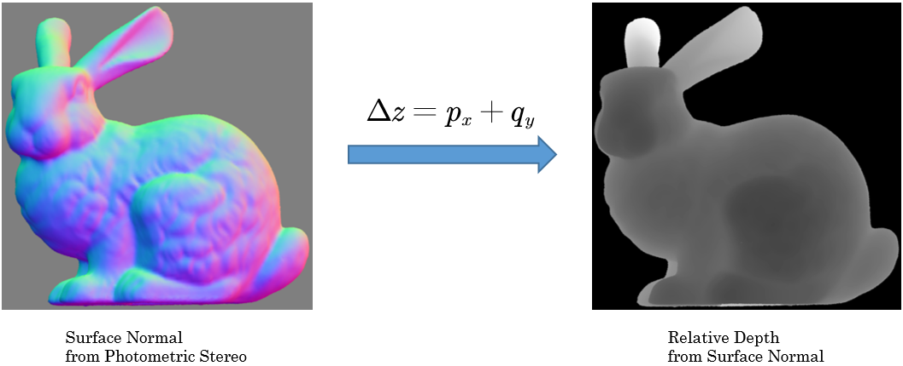
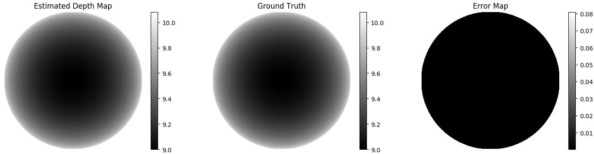
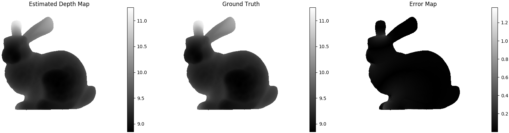

# Poisson Depth Recovery

## What is Depth Recovery?
Depth Recovery is using additional cues such like normal map, RGB image to enhance the
sparse depth map getting from depth sensor.

## What is Poisson Depth Recovery?
Poisson Depth Recovery is recovering depth map by solving a Poisson Equation. The Equation
comes from solving a functional.

Find the depth funciton 
whose gradient best approximates the surface normal (represented
by ). 

Equivalent to minimizing 
:

<p align="center">

</p>

Euler-Lagrange equation for this functional is a Poisson equation:

<p align="center">

</p>

<p align="center">

</p>


## How to use?
Download this package and run the main.py:

```
python main.py demo_name(sphere or bunny)
```

## Dependencies
Python 3.5.6
- numpy==1.17.2
- matplotlib==3.0.3
- opencv-python==4.1.1.26
- sparseqr==1.0.0
- sklearn==0.0
- scipy==1.3.1
```
apt-get install libsuitesparse-dev
pip install -r requirements.txt
pip install git+https://github.com/yig/PySPQR.git
```


## Result
<p align="center">

</p>

<p align="center">

</p>
