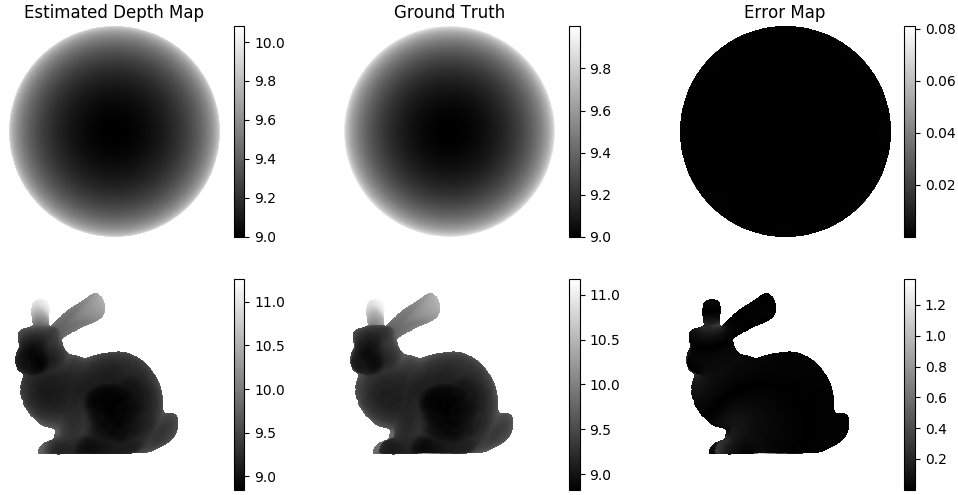

# Poisson Depth Recovery

## What is Depth Recovery?
Depth Recovery is using additional cues such like normal map, RGB image to enhance the
sparse depth map getting from depth sensor.

## What is Poisson Depth Recovery?
Poisson Depth Recovery is recovering depth map by solving a Poisson Equation. The Equation
comes from solving a functional.

Find the depth funciton 
whose gradient best approximates the surface normal (represented
by ). 

Equivalent to minimizing 
:

<p align="center">

</p>

Euler-Lagrange equation for this functional is a Poisson equation:

<p align="center">

</p>

<p align="center">

</p>


## How to use?
Download this package and run the main.py:
```
python main.py demo_name(sphere or bunny) projection_model(-o or -p)
```
The Poisson solver is in `./lib/poisson.py`. If you want to use your own data, you should normalize your normal map
into  form. The normal map's coordinate should align with 
the normal map in the README.

## Dependencies

How to install dependencies:
```
apt-get install libsuitesparse-dev
pip install -r requirements.txt
```

Tested on Python 3.5.6, Ubuntu Linux. Use Python wrapper for SuiteSparseQR to solve Poisson Equation.
You may check [SuiteSparseQR](https://github.com/yig/PySPQR) for detail.
- numpy==1.17.2
- matplotlib==3.0.3
- opencv-python==4.1.1.26
- sklearn==0.0
- scipy==1.3.1
- sparseqr==1.0.0


## Result
<p align="center">

</p>
